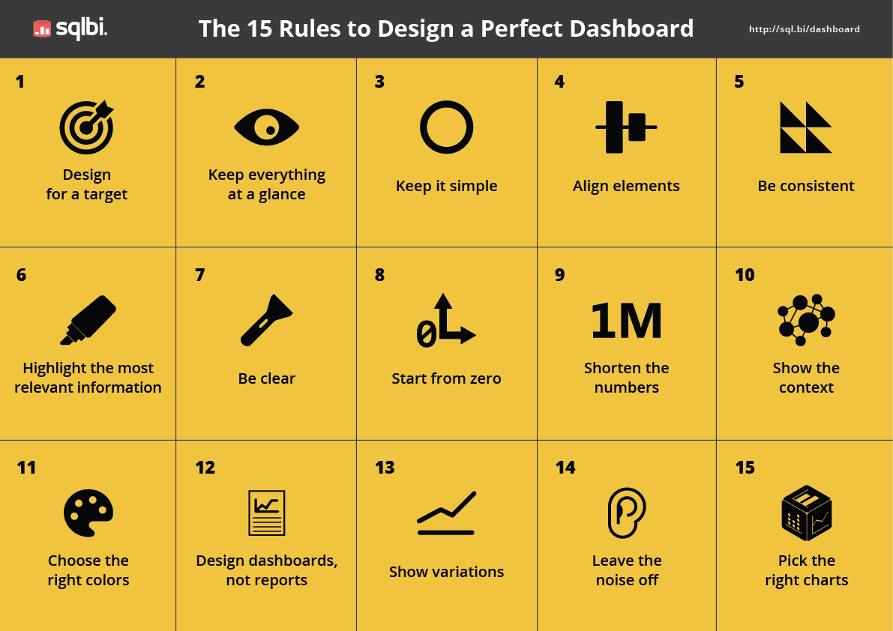
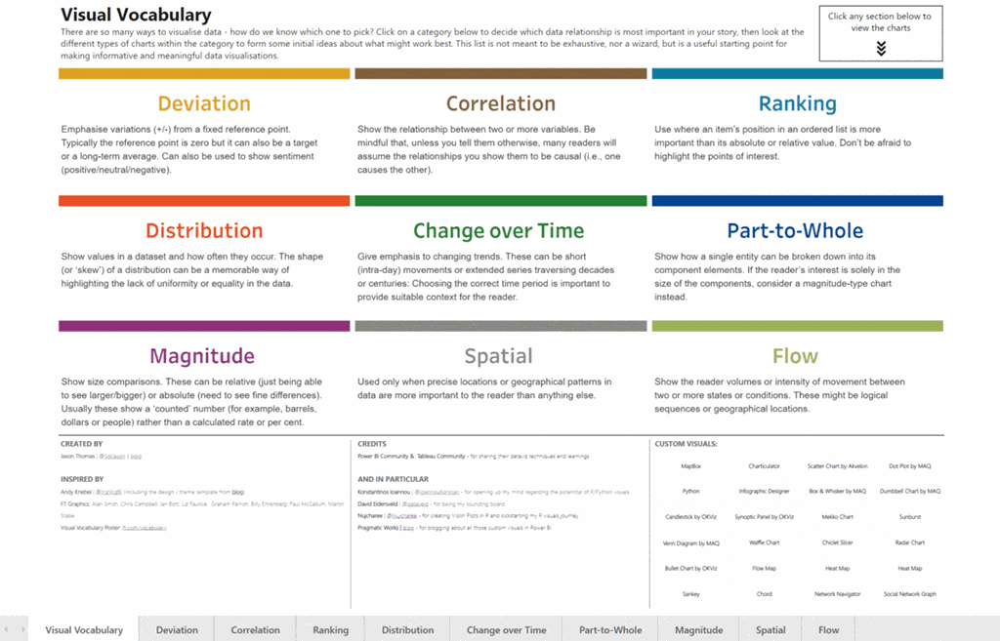
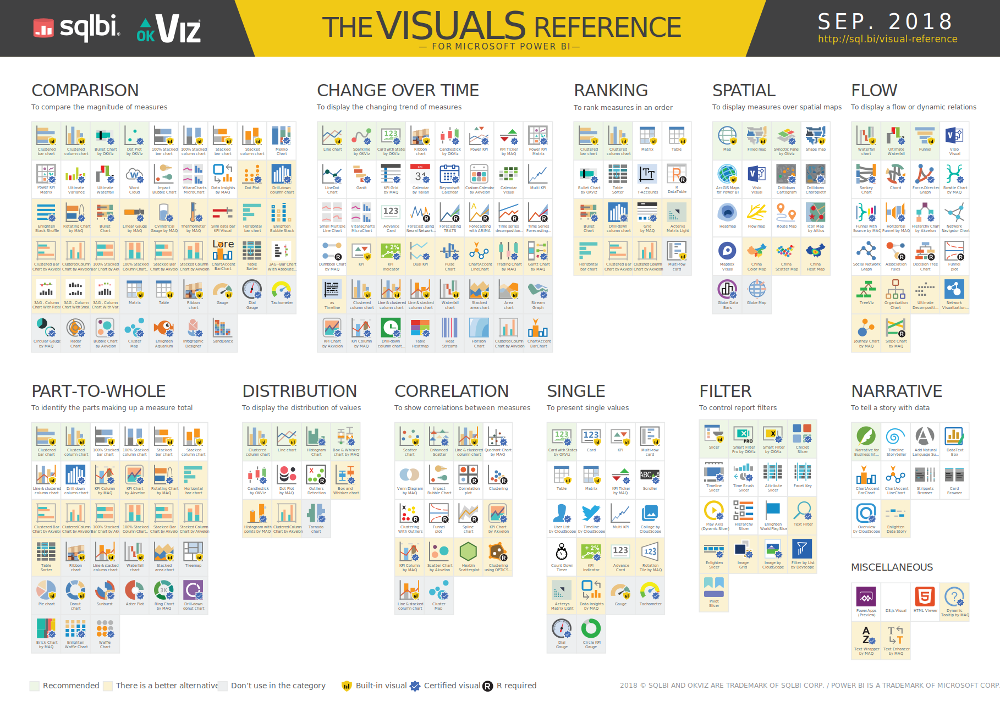

## Power BI Design of Dashboards and Reports

The design purpose should guide the selection of which Power BI visuals to use.

- Power BI dashboard design rules by SQLBI
  
    (click the image to follow link)

- [Visual Business Intelligence for enlightening analysis and communication by Stephen Few](http://www.perceptualedge.com/)

- [The Extreme Presentation Method by Andrew Abela](https://extremepresentation.com/design/) is a 10-step guide to creating  communications that drive action.
  - [The Extreme Presentation Slide Chooser](https://extremepresentation.typepad.com/blog/2015/01/announcing-the-slide-chooser.html)  This guide helps to identify the intent of the message and to choose slides accordingly.  The primary choice is whether a slide is intended to *explain* or *recommend* and the secondary choice is Where, When, Who, How, What, or Why.
  - The Extreme Presentation Chart Chooser is a selection guide according to the purpose of the chart visual: relationship, comparison, distribution or composition.   
      (click the image to follow link)

### Power BI bookmarks

- [How to use bookmarks to share insights and build stories](https://docs.microsoft.com/en-gb/power-bi/desktop-bookmarks)

- [Navigation with bookmarks and buttons by VisualBI](https://visualbi.com/blogs/microsoft/powerbi/designing-kpi-tile-navigation-power-bi-buttons-bookmarks/)

- [How to use bookmarks to toggle between two visuals](https://www.blue-granite.com/blog/using-data-driven-images-for-navigating-power-bi-bookmarks)

## Power BI visualizations by category

- FT Chart Doctor Visual Vocabulary

  - [FT Visual vocabulary on GitHub](https://github.com/ft-interactive/chart-doctor/tree/master/visual-vocabulary)
  
  - [FT Visual vocabulary Power BI edition by SqlJason.com](http://sqljason.com/2018/12/financial-times-visual-vocabulary-power-bi-edition.html)
  
  [FT-vv-pbix]: https://app.powerbi.com/view?r=eyJrIjoiMDA4YWIwZWEtMDE3ZS00YmFhLWE5YWMtODFlZWEzNTU1ODNiIiwidCI6IjZjMGE1YjljLTA4OWEtNDk0ZS1iMDVlLTcxNjEwOTgyOTA0NyIsImMiOjF9
  - [Link to full-screen PBI online version][FT-vv-pbix]  (click the image to follow link)
  
  [][FT-vv-pbix]

- [2018-10 Power BI visuals-reference-by-SQLBI](https://www.sqlbi.com/ref/power-bi-visuals-reference/)
  
  
  
- [Limited visualization types for Q&A in the Power BI Service](https://docs.microsoft.com/en-gb/power-bi/visuals/power-bi-visualization-types-for-reports-and-q-and-a)

## Power BI custom visuals

- [Samples on GitHub to help select Power BI custom visuals, including R-visuals](https://microsoft.github.io/PowerBI-visuals/samples/)

- [How to develop Power BI custom visuals](https://docs.microsoft.com/en-us/power-bi/developer/power-bi-custom-visuals)

- [How to build a custom visual for Power BI by James Dale](https://medius.studios.ms/Embed/Videodetails/MBAS19-BRK3020) (51 mins video)

### Return to
[Top](#power-bi-design-of-dashboards-and-reports)      [Back home](/.)
