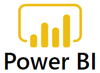

This site helps developers and teams to implement Power BI analytics solutions on the Azure Data Platform.  

The business purpose of analytics is to inform decisions with timely facts *and to encourage forward-vision and thinking*.  Driving a vehicle by *only* looking in the rear-view mirror or at a dashboard is foolhardy.  Likewise, reliance on time-lagged measures alone puts an enterprise in danger.

Analytics are only part of the iterative improvement cycle known as "Plan, Do, Check, Adjust" (PDCA).

All usage of this site and links to other sites is at your own discretion and risk.

## Beyond Power BI: some amazing demonstrations

- **[GapMinder data presented in Power BI](https://beyondpowerbi.com/Power-BI-samples-GapMinder/)**  
  Compelling visualisations encourage fact-based decisions.  
  See a Power BI sample using gapminder.org/data/ and the [Roslings' book 'Factfulness'](https://en.wikipedia.org/wiki/Factfulness:_Ten_Reasons_We%27re_Wrong_About_the_World_%E2%80%93_and_Why_Things_Are_Better_Than_You_Think).  
- **[Power BI Design and Visualizations](https://beyondpowerbi.com/Power-BI-Design-and-Visualizations/)** for purpose-driven visualizations.  
  A report with a clear message starts with good design; a 'visual vocabulary' helps to select the most appropriate visualizations, once the design intent is known. 
- **[DAX patterns and Data Models illustrated in Power BI](https://beyondpowerbi.com/Power-BI-samples-DAX-patterns/)** 
A pattern is a general reusable solution to a commonly occurring problem - a route to productivity and reliability.  These examples I adapted into Power BI from Excel examples made by others.
- **[Power BI Integrations](https://beyondpowerbi.com/Power-BI-integrations/)** 
  Artistic reports alone would mislead if based on wrong or late data.   
  "Beyond Power BI" we need appropriate upstream data sources and downstream processes for decision-taking, implementation and review/feedback loops.
  
- **[PowerBI aggregations and composite models](https://beyondpowerbi.com/Power-BI-aggregations-composite-models/)**  are arguably the most impressive new features of Power BI released in 2018; they are useful for big data sources.
  
## [Resources and standards for Power BI deployment and projects](https://beyondpowerbi.com/Power-BI-deployment/)** 

To balance the advantages of 'self-service business intelligence (BI)' with the advantages of reliable IT processes requires respect for relevant best practices.  Good policies need deliberate implementation.
  
Agile software engineering methods, including formal testing and DevOps automation, are increasingly applied to Power BI.  These links show what is possible today and give a preview of new features coming in 2020.

- **[Power BI Deployment](https://beyondpowerbi.com/Power-BI-deployment/)** 

### About me
[Tom Fox on LinkedIn](https://www.linkedin.com/in/tomfox247/)

### About Microsoft Azure Data Platform, Azure Synapse Analytics and Power BI

**[Overview of Azure Data Platform](https://azure.microsoft.com/en-gb/overview/data-platform/)**

**[Overview of Microsoft Power Platform](https://powerplatform.microsoft.com/en-gb/)**

